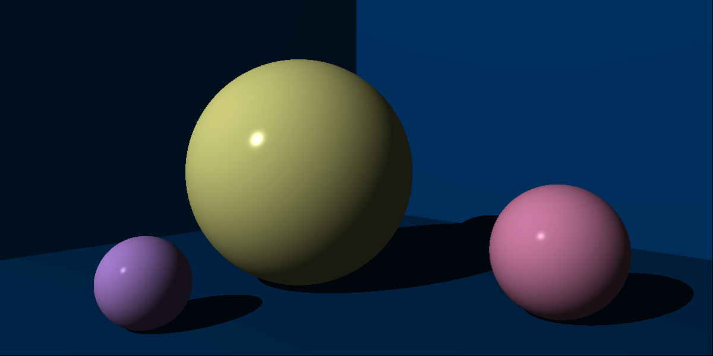
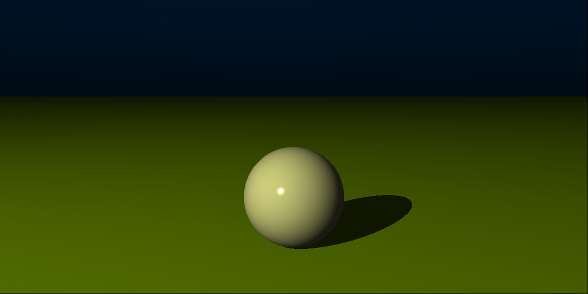

# Project Apollo

An experimental Ray Tracer built on the .NET platform.

## Project Structure

- Apollo Core > _Contains the Ray Tracer Program_
  - Math > Contains basic mathematical objects including tuples & matrices
  - Display > Code related to colours, cameras and outputting images (PPM)
  - Lighting > Code used for modelling lighting, including rays, materials and shader algorithms
  - Geometry > Contains various geometric objects such as spheres & planes

- Apollo.Tests > _Contains all the unit tests for TDD (Test Driven Design)_

### Ray Spheres

### Shaders

### Camera System

### Shadows

### Planes

